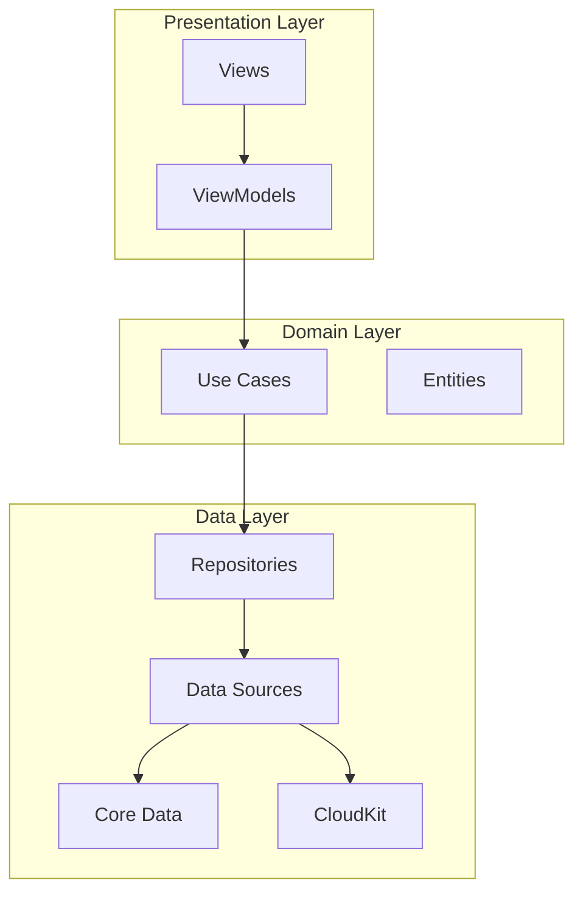

# MINE - アーキテクチャ設計書

## 1. システム概要



## 2. レイヤー責務

### 2.1 Presentation Layer
- **Views**: SwiftUIビュー、UIの表示とユーザー入力
- **ViewModels**: ビューロジック、状態管理、データバインディング

### 2.2 Domain Layer
- **Use Cases**: ビジネスロジック、アプリケーション固有の操作
- **Entities**: ビジネスモデル、ドメイン固有のデータ構造

### 2.3 Data Layer
- **Repositories**: データアクセスの抽象化
- **Data Sources**: 具体的なデータアクセス実装
- **Core Data**: ローカルデータ永続化
- **CloudKit**: クラウド同期（有料版）

## 3. データフロー

### 3.1 記録作成フロー
```
1. RecordingView -> RecordingViewModel.startRecording()
2. RecordingViewModel -> CreateRecordUseCase.execute()
3. CreateRecordUseCase -> RecordRepository.save()
4. RecordRepository -> LocalDataSource.save()
5. LocalDataSource -> CoreDataStack.save()
6. (有料版) -> CloudDataSource.sync()
```

### 3.2 記録取得フロー
```
1. RecordsView -> RecordsViewModel.loadRecords()
2. RecordsViewModel -> GetRecordsUseCase.execute()
3. GetRecordsUseCase -> RecordRepository.fetch()
4. RecordRepository -> LocalDataSource.fetch()
5. LocalDataSource -> CoreDataStack.fetch()
6. データ変換 -> ViewModel更新 -> View更新
```

## 4. モジュール構成

### 4.1 Core Modules
```
Core/
├── Models/
│   ├── Record.swift
│   ├── Folder.swift
│   ├── Tag.swift
│   └── RecordTemplate.swift
├── Database/
│   ├── CoreDataStack.swift
│   ├── Entities/
│   └── Migrations/
├── Services/
│   ├── MediaService.swift
│   ├── SubscriptionService.swift
│   └── CloudSyncService.swift
└── Utilities/
    ├── Extensions/
    ├── Helpers/
    └── Constants.swift
```

### 4.2 Feature Modules
```
Features/
├── Home/
│   ├── Views/
│   │   ├── HomeView.swift
│   │   └── DashboardView.swift
│   └── ViewModels/
│       └── HomeViewModel.swift
├── Recording/
│   ├── Views/
│   │   ├── RecordingView.swift
│   │   ├── CameraView.swift
│   │   └── AudioRecordingView.swift
│   ├── ViewModels/
│   │   └── RecordingViewModel.swift
│   └── Services/
│       ├── CameraService.swift
│       └── AudioService.swift
├── Records/
│   ├── Views/
│   │   ├── RecordsView.swift
│   │   ├── TimelineView.swift
│   │   └── HeatmapView.swift
│   └── ViewModels/
│       └── RecordsViewModel.swift
└── Settings/
    ├── Views/
    │   ├── SettingsView.swift
    │   └── SubscriptionView.swift
    └── ViewModels/
        └── SettingsViewModel.swift
```

## 5. 依存性注入

### 5.1 Container構成
```swift
@MainActor
class DIContainer: ObservableObject {
    // Services
    lazy var mediaService = MediaService()
    lazy var subscriptionService = SubscriptionService()
    lazy var cloudSyncService = CloudSyncService()
    
    // Repositories
    lazy var recordRepository = RecordRepository(
        localDataSource: localDataSource,
        cloudDataSource: cloudDataSource
    )
    
    // Data Sources
    lazy var localDataSource = LocalDataSource(coreDataStack: coreDataStack)
    lazy var cloudDataSource = CloudDataSource()
    
    // Core Data
    lazy var coreDataStack = CoreDataStack()
}
```

## 6. 画面遷移設計

### 6.1 Coordinator Pattern
```swift
class AppCoordinator: ObservableObject {
    @Published var selectedTab: Tab = .home
    @Published var presentedSheet: Sheet?
    @Published var navigationPath = NavigationPath()
    
    func showRecording(type: RecordType) { }
    func showRecordDetail(_ record: Record) { }
    func showSettings() { }
}
```

### 6.2 画面遷移フロー
```
TabView
├── Home
│   ├── → Recording (Modal)
│   └── → Record Detail (Push)
├── Records
│   ├── → Record Detail (Push)
│   ├── → Comparison View (Modal)
│   └── → Filter View (Sheet)
└── Settings
    ├── → Subscription (Push)
    └── → About (Push)
```

## 7. 状態管理

### 7.1 Global State
- UserSettings: @AppStorage
- SubscriptionStatus: @StateObject
- SyncStatus: @StateObject

### 7.2 Local State
- View固有の状態: @State
- ViewModel: @StateObject / @ObservedObject
- 環境値: @Environment / @EnvironmentObject

## 8. エラーハンドリング

### 8.1 エラー階層
```swift
enum MINEError: Error {
    case recording(RecordingError)
    case storage(StorageError)
    case sync(SyncError)
    case subscription(SubscriptionError)
    case network(NetworkError)
}
```

### 8.2 エラー処理フロー
1. エラー発生
2. Use Case層でキャッチ
3. ViewModelに伝播
4. Viewでユーザーに表示
5. 必要に応じてリトライ機能提供